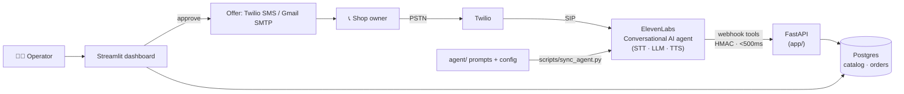

# RMG AI Receptionist

**A voice agent that answers the phone for a garments wholesaler in Bangladesh and takes
reorders — in English and in Banglish — then hands every order to a human before anything
is real.**


---

## The problem

A Dhaka garments wholesaler takes reorders by phone all day. Retail shop owners call and
order from memory — *"the black polo from last month, dozen and a half"* — in **Banglish**
(Bengali grammar, English product names and numbers mixed in). It's a good job for a voice
agent, with two hard constraints that shape everything:

1. **A mis-heard quantity is real money.** "3 dozen" heard as "30 dozen" ships ten times the
   goods. Speech-to-text on Bengali numbers is the single biggest risk.
2. **No owner will hand order-entry to an AI on day one.** Trust has to be earned.

So this isn't a chatbot demo. It's built like a tool a real wholesaler could run — and as a
portfolio piece for an ElevenLabs **Forward-Deployed Engineer** application.

## What it does

The agent answers, takes the order, and reads it back — but **only a human makes it real.**

```
call → identify shop → resolve items from the catalog → quantity → stock check
     → read the quantity back  →  DRAFT order
                                     ↓
                          human reviews in the dashboard
                                     ↓
                    CONFIRMED → offer sent by SMS or email
                                (in the caller's language)
```

- **Reads the quantity back, always.** *"Dozen and a half — that's eighteen pieces, correct?"*
  This is the safety net for the ASR risk, and it's mandatory in the prompt.
- **Never invents anything.** No SKU, price, or stock figure the catalog didn't return.
- **Never confirms, negotiates price, or extends credit.** Those escalate to a human.
- **English and Banglish** from one phone number — a locale layer, not a forked codebase.

> 📹 *Demo video: coming soon.* &nbsp;·&nbsp; 🖥️ *Dashboard screenshot: coming soon.*

## Architecture



| Component | Role |
|---|---|
| **ElevenLabs Conversational AI** | The agent: STT, LLM, TTS, tool-calling. Config + prompts live in the repo, pushed by `scripts/sync_agent.py`. |
| **FastAPI** (`app/`) | Hosts the agent's webhook tools; every handler answers in <500 ms with no external calls. |
| **Postgres** (`app/models.py`) | Catalog, customers, orders, call logs. Money is integer US cents; quantities are pieces. |
| **Streamlit** (`dashboard/`) | Where a human reviews drafts and approves → triggers the offer. |
| **Twilio + Gmail SMTP** (`app/notify.py`) | Delivers the final offer by SMS or email, rendered in the caller's language. |
| **`app/locale/`** | The one place language varies: spoken unit aliases + offer wording. |

## The ElevenLabs integration

- **Repo is the source of truth, not the dashboard.** `scripts/sync_agent.py` pushes the
  prompt, voice, model, and the four webhook tools to the agent, and reassigns the phone
  number — so the agent is diffable, reviewable, and redeployable for a second customer.
- **Webhook tools with a budget.** `search_catalog`, `check_stock`, `create_draft_order`,
  `escalate_to_human` are HTTP tools authenticated with a shared secret; each returns in
  under 500 ms (one indexed query, no N+1, no external calls) so the call never stalls.
- **The TTS-model journey.** English runs on `eleven_turbo_v2`. Bengali only works on one
  model — verified against `GET /v1/models` — and for a *convai agent* the correct id turned
  out to be **`eleven_v3_conversational`** (not `eleven_v3`, which the agent endpoint
  rejects). That kind of API-reality-vs-docs gap is the everyday work.
- **One number, two languages.** `scripts/serve.py en|bn` builds a locale's agent and points
  the number at it — flip the locale to switch what the line answers in.

## Design decisions

Enforced as invariants (`CLAUDE.md`), with the reasoning in [`docs/DECISIONS.md`](docs/DECISIONS.md):

- **The agent only drafts; a human confirms.** Approval is the feature that makes it
  sellable, not a limitation.
- **Mandatory quantity read-back.** The human-in-the-loop catch for ASR errors on numbers.
- **Never invent a SKU, price, or stock level.** If a tool returns nothing, say so.
- **Money is integer US cents, never float.** Quantities are pieces; dozen/hali/gross convert
  only at the edge in `app/locale/units.py`.
- **Locale is a data layer, not a fork.** Adding a language is three data edits — see
  [`docs/EXTENDING.md`](docs/EXTENDING.md).
- **Secrets stay in `.env`; raw phone numbers are never logged** (hashed).

## Field notes

Forward-deployed work is debugging live systems, not just writing them:

- **De-risked ASR before building on it.** A day-one spike measured number survival on 19
  Banglish clips: whole numbers ~83% exact, but no-cognate fractions fused to a short unit
  (*দেড় পিস*) corrupt. Verdict: proceed, and make the read-back explicit for fractions. The
  whole product design follows from that measurement.
- **Caught a read-back that fabricated quantities.** The Bangla prompt's "restate the total
  pieces" made the LLM invent an 8× conversion on a plain piece count (500 → "4,050"). Fixed
  by bounding piece-equivalents to dozen/hali/gross with exact multipliers only.
- **Killed a silent footgun in the deploy script.** A sync without the public URL was
  stripping the agent's order tools — the agent could greet but not take an order.
  `sync_agent.py` now preserves attached tools on a prompt-only sync.

## Run it

```bash
uv sync
cp .env.example .env     # fill DATABASE_URL, AGENT_TOOL_SECRET, ELEVENLABS_*, TWILIO_*, GMAIL_*
openssl rand -hex 32     # -> AGENT_TOOL_SECRET
uv run python scripts/seed.py            # tables + 15-SKU catalog
```

Then one command brings the agent online and holds it there:

```bash
uv run python scripts/serve.py        # English   (serve.py bn for Banglish)
```

It starts the app, opens a tunnel, reads the tunnel URL itself, syncs that language's agent,
and points the phone number at it. Call the number and place an order. Review it here:

```bash
uv run streamlit run dashboard/main.py --server.port 8501
```

More detail in [`docs/RUNBOOK.md`](docs/RUNBOOK.md) (operations, switching languages,
recovery) and [`docs/OUTBOUND.md`](docs/OUTBOUND.md) (calling a tester). Quality gate:

```bash
uv run pytest ; uv run mypy app ; uv run ruff check app tests scripts
```

## Extending

Adding a language, product, or offer channel is a data edit, not a code fork — see
[`docs/EXTENDING.md`](docs/EXTENDING.md). A new language is: a prompt file, a config block,
and one `Locale` entry in `app/locale/registry.py`.

## Project layout

```
app/
  api/            FastAPI routes: agent tools + ElevenLabs webhooks
  tools/          the agent tools (schemas → registry → handlers)
  locale/         everything language-varying: registry.py + units.py
  models.py       data model (Customer, Product, Order, OrderItem, CallLog)
  notify.py       the final offer (SMS via Twilio, email via Gmail SMTP)
  security.py     tool-secret + webhook-HMAC auth, phone hashing
agent/            versioned prompts + agent config (pushed by sync_agent.py)
scripts/          serve.py (one-command up) · sync_agent.py · seed.py · outbound_call.py
dashboard/        Streamlit operator UI
docs/             CONTEXT · DECISIONS · ROADMAP · EXTENDING · RUNBOOK · OUTBOUND · GLOSSARY
tests/            pytest suite + the ASR-spike fixtures
```

**Stack:** Python 3.13 · FastAPI · Pydantic v2 · SQLModel + Alembic · Postgres · uv · ruff ·
mypy (strict) · pytest · ElevenLabs Conversational AI + Scribe STT · Twilio · Streamlit.

## Limitations

Kept honest:

- Not yet validated with a real wholesaler; the catalog is seeded demo data.
- Bangla ASR on numbers is measured, but on a small batch sample — the live streaming path
  may degrade further. The read-back is the mitigation, not a fix.
- No payments or accounting integration; catalog stock is not tied to a real inventory system.
- Outbound calling exists only as a **demo convenience** for testers, not a product feature.
- Not production-hardened (single-tenant, quick-tunnel webhooks, no rate limiting).

## License

MIT.
